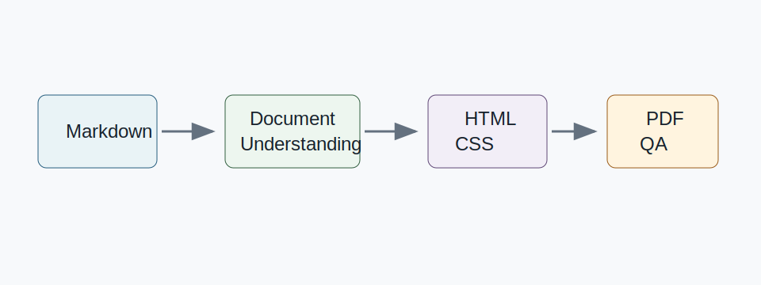

<p align="center"><b>简体中文</b> | <a href="./README_en.md">English</a></p>

# md2pdf

一句话说明：这个 Skill 帮你把 Markdown 文档重新理解、排版并渲染成适合交付的精美 PDF，而不是简单套默认浏览器样式。

## 这个版本能做什么

- 解析 Markdown 标题、段落、列表、表格、引用、代码块、图片和链接。
- 自动识别文档类型，并选择适合报告、PRD、研究简报或知识笔记的版式。
- 生成封面、目录、页眉页脚、页码和打印友好的 A4 页面。
- 将 `diagram`、Mermaid 和 ASCII 箭头代码块通用编码为流程图、分层图、矩阵图或结构卡片。
- 将 Markdown 转为中间 HTML/CSS，再用 Playwright 或 Chromium/Chrome 渲染 PDF。
- 运行基础 PDF QA，检查文件存在、页数、大小和渲染日志。

## 适合谁

- 需要把 Markdown 报告、PRD、研究笔记或知识库内容交付成 PDF 的人。
- 不想手工调 Word/PPT 版式，但又不满意默认 Markdown 导出效果的人。
- 需要可复用模板和自动 QA 的 Codex Skill 用户。

## 使用示例

仓库内提供了示例输入：

```bash
python3 scripts/main.py --input examples/input.md --output output.pdf --template elegant-report
```

带标题、作者、日期和目录：

```bash
python3 scripts/main.py \
  --input examples/input.md \
  --output output.pdf \
  --template elegant-report \
  --title "AI 产品分析报告" \
  --author "Hank" \
  --date "2026-06-26" \
  --toc true \
  --debug
```

示例图形素材：



## 快速开始

安装依赖：

```bash
python3 -m pip install -r requirements.txt
python3 -m playwright install chromium
```

如果没有 Python Playwright，脚本会尝试 Node Playwright，最后回退到本机 Chromium/Chrome。macOS 默认检测：

```text
/Applications/Google Chrome.app/Contents/MacOS/Google Chrome
```

如果 Chrome 在其他位置：

```bash
export MBPDF_CHROME_PATH="/path/to/chrome"
```

## 常见用法

- 使用 `elegant-report` 输出中文报告、PRD、研究分析和知识库文档。
- 使用 `--template auto` 让脚本根据内容推断文档类型。
- 使用 `--debug` 保留中间 HTML，便于检查排版。
- 单独运行 QA：

```bash
python3 scripts/qa_pdf.py --pdf output.pdf --html output.html
```

## 当前限制

- Markdown parser 是轻量实现，不覆盖所有 CommonMark 边界情况。
- 页码依赖 Chromium 对 CSS page counter 的支持，不同 Chrome 版本可能表现有差异。
- QA 目前以文件级检查为主，还不能完全替代人工视觉检查。
- `product-doc`、`research-brief`、`knowledge-note` 仍是第一版模板骨架，独立版式系统还在扩展中。

## 安全与隐私说明

- 不要把包含公司内部资料、客户数据、个人隐私或凭证的 Markdown/PDF 提交到公开仓库。
- 本工具不需要 token、Cookie、API key 或远程服务凭证。
- 调试产物和生成 PDF 应输出到明确路径，避免混入源码提交。

## 技术实现

```text
Markdown -> 文档理解 -> 排版策略 -> 内容重构 -> HTML/CSS -> PDF 渲染 -> QA 检查 -> 最终 PDF
```

- `scripts/main.py` 是端到端入口。
- `scripts/parse_md.py` 负责 Markdown 解析和文档分类。
- `scripts/build_html.py` 生成打印友好的 HTML/CSS。
- `scripts/render_pdf.py` 通过 Playwright 或 Chromium/Chrome 渲染。
- `scripts/qa_pdf.py` 运行基础 PDF QA。
- `templates/elegant-report/` 是当前主模板。

## Roadmap

- 增加 PDF 回渲图片检查，检测空白页、表格过宽和代码块溢出。
- 为 PRD、研究简报、知识笔记扩展独立版式。
- 增加更完整的 Markdown parser 或可选 `markdown-it-py` 支持。
- 增加字体嵌入和品牌主题配置。

## License

[MIT](./LICENSE)

## Contributors

<table>
  <tr>
    <td align="center">
      <a href="https://github.com/hankchn">
        
        <br />
        <sub><b>hankchn</b></sub>
      </a>
      <br />
      <sub>Hank Yang</sub>
    </td>
    <td align="center">
      <a href="https://openai.com/codex">
        
        <br />
        <sub><b>Codex</b></sub>
      </a>
      <br />
      <sub>OpenAI Codex</sub>
    </td>
  </tr>
</table>
